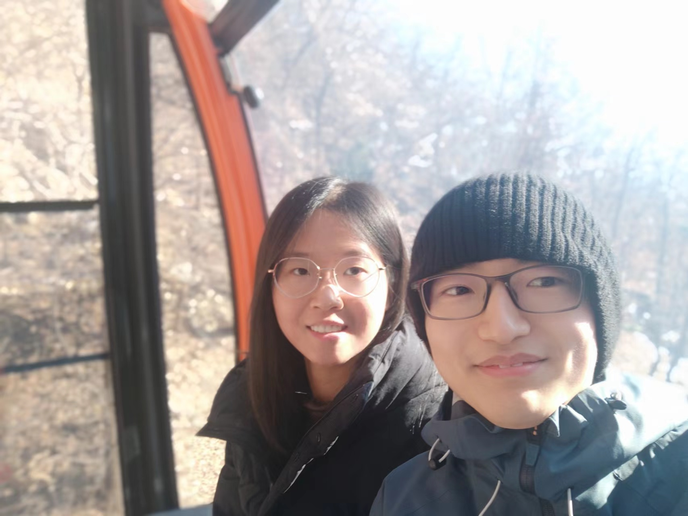
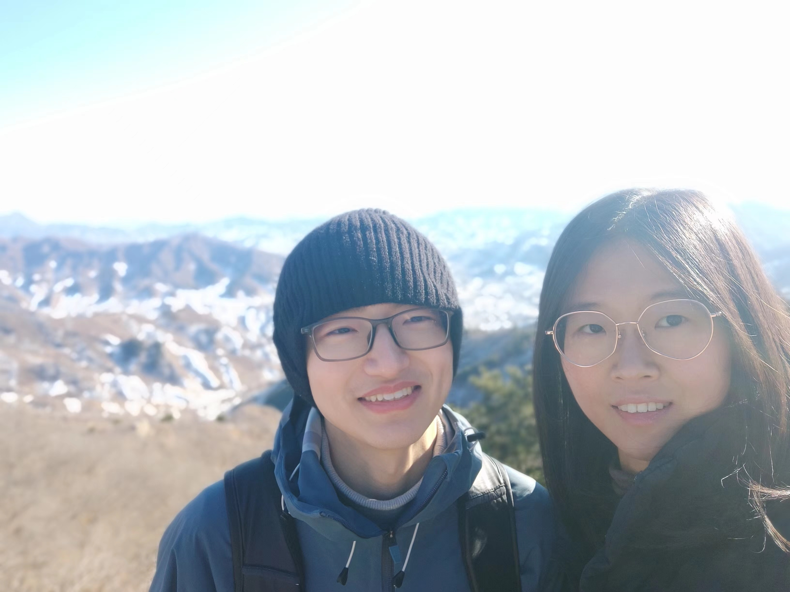
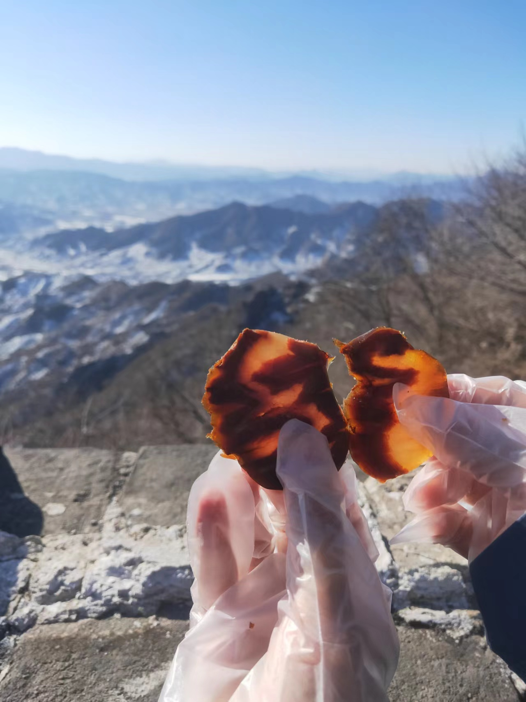
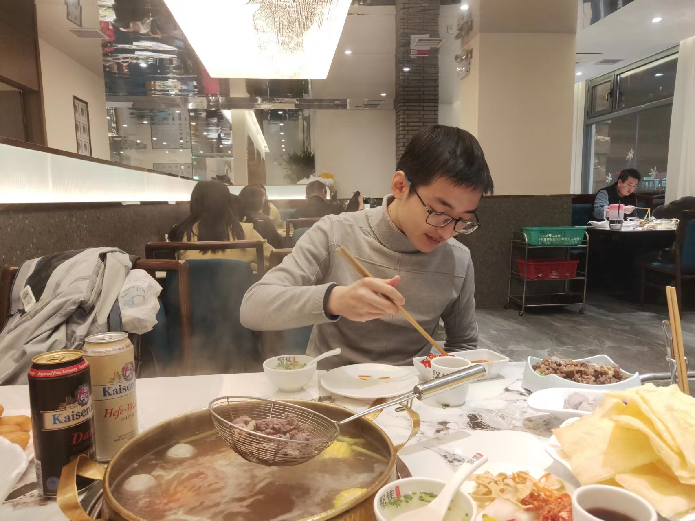

+++
title = "慕田峪长城&奥森跨年实录"
date = "2023-12-31"
+++

> 作者：zerolord
> 
> 与我相见欢，何求岁月长，只别辜负了春光

以下是一个简略版慕田峪长城攻略，以及一些出游照片。

简介：
1. 慕田峪长城比八达岭长城小众，游客较少
2. 慕田峪长城分为西线和东线，东线以滑道著名（我俩没去），风景较好的西线长城共有二十个敌楼，最高点为二十号敌楼
3. 缆车直达十四号敌楼，之后要自己爬六个敌楼，一上一下大概要两个半小时

准备：
1. 防晒qiufeng带的是安耐晒，虽然不知道效果咋样，但主要起个心理作用
2. 登山杖准备一个就好，因为我男朋友就是俺的人形登山杖
3. 食物和水是qiufeng在菜鲜果美整的，牛肉很不错，比盒马的新鲜好吃；橙子也不错，没想到这种很容易中看不中用的店居然有这么甜的橙子；农夫山泉婴儿水，我克制过自己了，才没有把婴儿水泼qiufeng身上；可惜的是他德芙买了好像忘记拿了，上了年纪老忘事儿（晚上还忘记了拿登山棍儿）
4. 帽子不错，挺保暖的
5. 手套可恶，挺保他手的
6. 去爬山的话还可以锻炼下qiufeng臂力，因为我会拿不动东西，qiufeng需要感谢我
7. 充电宝带得好，qiufeng真机智，不过好像他手机中间没充电

踩坑：
1. 提前买了北京旅游集散中心的大巴票，在导游的解说下我俩买了缆车，从而导致我俩爬得不够尽兴
2. 缆车，这个缆车性价比不高，参考华山等一系列我爬过的山

建议：
1. 慕田峪还是人少且风景不错的
2. 二十岁左右有一定锻炼习惯的年轻人，可以考虑直接坐地铁等交通工具去，然后买门票自己爬即可，缆车还是给老人和小孩儿准备的

成就达成：
* 对qiufeng上下其手
* 亲到qiufeng脸颊

去长城的路上和回来的路上，可以在qiufeng身上摸来摸去，就是他反抗有点激烈，不过没关系，（抹掉鼻血），（叉会儿腰），（仰天大笑），（不愧是我）！

去地铁口的时候嘬了他几口，口感像嘬汤圆。我确信qiufeng是汤圆，理由如下：汤圆是白的，他也是白的，汤圆是软软糯糯的，他也是软软糯糯的，汤圆外皮没啥味道，一咬就是甜甜的，qiufeng也是本身没啥味道，亲起来是甜甜的。

十八岁的我一定会鄙视现在边谈小对象边影响市容的我，不理解在山上像个傻狗一样大喊“喜欢qiufeng”的我，不理解一贴贴就没个够、一黏到小对象身上就撕不下来的我，但是十八岁的我想象不到二十三岁的我有多快乐。

列点和我家小宝贝的照片：

2023.12.9在一起

2023.12.31去长城跨年

tbc.
